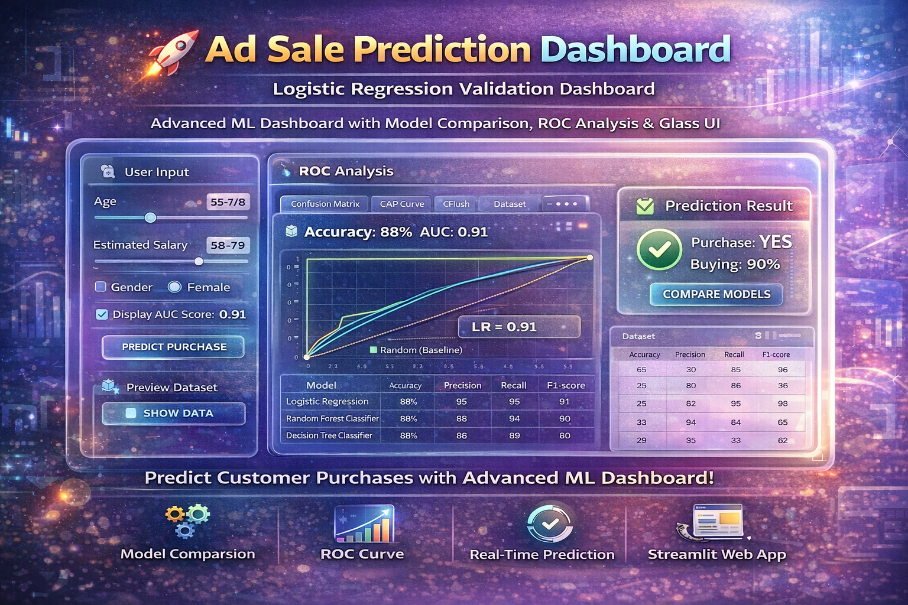

  

---

# 🚀 Ad Sale Prediction Dashboard  
### Logistic Regression Validation | Streamlit ML App

An advanced Machine Learning Dashboard that predicts customer purchase behavior using digital advertisement data, enhanced with model comparison, ROC analysis, and a premium Glassmorphism UI built using Streamlit.

---

## 📌 Project Overview

This project is an end-to-end ML system that not only predicts whether a user will purchase a product but also provides deep model validation and performance comparison.

Unlike basic ML projects, this includes:
- Multiple model evaluation techniques  
- Real-time prediction interface  
- Interactive visualization dashboard  

---

## 🎯 Objectives

- Predict customer purchase behavior from ad data  
- Build and validate a Logistic Regression model  
- Compare performance with Random Forest & Decision Tree  
- Visualize performance using ROC Curve & AUC  
- Create an interactive ML dashboard using Streamlit  

---

## 🧠 Features

- Real-time Prediction System  
- Glassmorphism UI (Premium Design)  
- Model Comparison (LR vs RF vs DT)  
- ROC Curve Visualization  
- Accuracy Metrics Display  
- Dataset Preview Option  

---

## ⚙️ Tech Stack

- Python  
- Pandas  
- NumPy  
- Scikit-learn  
- Matplotlib  
- Streamlit  

---

## 📂 Project Structure

ad_sale_lr_validation/
│
├── data/
│   └── digital_ad_dataset.csv
│
├
│   
│  
│
├── app.py
├── main.py
├── requirements.txt
└── README.md

---

## 📊 Machine Learning Workflow

1. Data Loading  
2. Data Preprocessing  
3. Feature Scaling  
4. Train-Test Split  
5. Model Training  
6. Predictions  
7. Model Evaluation  
8. Model Comparison  
9. Visualization  

---

## 🤖 Models Used

- Logistic Regression  
- Random Forest Classifier  
- Decision Tree Classifier  

---

## 📈 Model Evaluation Techniques

- Accuracy Score – Measures overall performance  
- Confusion Matrix – Classification analysis  
- ROC Curve – Performance across thresholds  
- AUC Score – Classification capability  
- K-Fold Cross Validation – Model stability  
- Stratified K-Fold – Balanced validation  
- CAP Curve – Model vs Random vs Perfect comparison  

---

## 🚀 Streamlit Dashboard Features

- Interactive sliders for input  
- Live prediction output  
- ROC curve comparison  
- Model accuracy comparison  
- Dataset preview  

---

## ▶️ How to Run the Project

1. Clone the Repository
git clone https://github.com/selvan-01/ad_sale_lr_validation.git
cd ad_sale_lr_validation  

2. Install Dependencies
pip install -r requirements.txt  

3. Run the App
streamlit run app.py  

---

## 📌 Dataset

- Contains user demographic and behavioral data  
- Used for predicting product purchase decisions  
- Target Variable: Purchase (0 / 1)  

---

## 🧩 Key Highlights

- End-to-End ML Pipeline  
- Interactive Dashboard UI  
- Multi-Model Comparison  
- Advanced Validation Techniques  
- Clean and Scalable Code  

---

## 📣 Future Enhancements

- Hyperparameter tuning  
- Add XGBoost and Neural Networks  
- Deploy on Streamlit Cloud or AWS  
- Add authentication system  
- Real-time data integration  

---

## 👨‍💻 Author

S. Senthamil Selvan (Sen)  
Final Year CSE Student  
AI | Data Science | Content Creator  

---

## ⭐ Support

If you like this project:

- Star this repository  
- Share on LinkedIn  
- Connect with me  

---
## 🔗 Links

- 💼 [LinkedIn](https://www.linkedin.com/in/senthamil45)
- 🌍 [Portfolio](https://senthamill.vercel.app/)
- 💻 [GitHub](https://github.com/selvan-01/ad_sale_lr_validation.git)

## 📬 Contact

Email: senthamils445@gmail.com  
 

---

🔥 Transforming Data into Intelligent Decisions with Machine Learning
